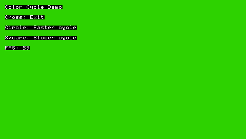
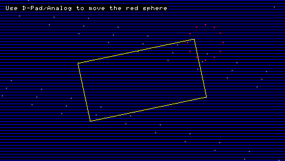

Sample scripts for Python on the Sony PSP, using the Python 2.5.2 (Stackless 3.1b3) port. Save the samples as `script.py` in the same folder as the Python interpreter (i.e. `EBOOT.PBP`) to run them.

## Sample scripts created by Sakya (2009)

The assets required to test these demos are available on the [release page of the repo](https://github.com/pierrelouys/PSP-StacklessPythonOSLibMOD/releases/) (`StacklessOSLibMOD-samples.zip`). 

### objects


```
# -*- coding: ISO-8859-1 -*-
import osl, pspos, drawable, random

osl.initGfx(osl.PF_5551, True)
osl.setDithering(True)
osl.setQuitOnLoadFailure(True)
osl.setFrameskip(1)
osl.setKeyAnalogToDPad(80)

bkg = osl.Image('bkg.png', osl.IN_RAM | osl.SWIZZLED, osl.PF_5551)
sprite = osl.Image('sprite.png', osl.IN_RAM | osl.SWIZZLED, osl.PF_5551)

ofont = osl.Font("font.oft")
osl.setTextColor(osl.RGBA(255,255,255,255))
osl.setBkColor(osl.RGBA(255,255,255,0))
ofont.set()

#Sprite animations (move and rotate)
def spriteAnim(obj):
    obj.image.rotate(obj.data["rotate"])
    newX = obj.x + obj.data["moveX"]
    newY = obj.y + obj.data["moveY"]
    sizeX = obj.image.centerX
    sizeY = obj.image.centerY
    if newX + sizeX > 480 or newX - sizeX < 0:
        obj.data["moveX"] = -obj.data["moveX"]
    elif newY + sizeY > 272 or newY - sizeY < 0:
        obj.data["moveY"] = -obj.data["moveY"]
    obj.x += obj.data["moveX"]
    obj.y += obj.data["moveY"]

def addSprite(layer, objName=None):
    if not objName:
        objName = "obj_%2.2i" % len(layer.objects)
    obj = drawable.imageObj(objName)
    obj.image = osl.Image((sprite.sizeX, sprite.sizeY), osl.IN_RAM, osl.PF_5551)
    sprite.copy(obj.image)
    obj.image.swizzle()
    obj.image.setRotationCenter()
    obj.x = random.randint(obj.image.centerX, 480 - obj.image.centerX)
    obj.y = random.randint(obj.image.centerY, 272 - obj.image.centerY)
    obj.data["rotate"] = random.randint(1, 5)
    obj.data["moveX"] = random.randint(1, 5)
    obj.data["moveY"] = random.randint(1, 5)
    obj.animations.append(spriteAnim)
    layer.addObject(obj)


def removeSprite(layer):
    names = layer.objects.keys()
    names.sort()
    if len(names):
        nameObj = names.pop()
        layer.removeObjectByName(nameObj)

layers = []
#Initial sprite objects
sprites = drawable.layer()
for i in xrange(0, 20, 1):
    addSprite(sprites)

layers.append(sprites)

#Initial generic objects
objects = drawable.layer()

#FPS
FPSobj = drawable.stringObj("FPS")
FPSobj.font = ofont
FPSobj.x = 5
FPSobj.y = 5
def FPSAnim(obj):
    obj.string = "FPS: %i" % osl.getFPS()
FPSobj.animations.append(FPSAnim)
objects.addObject(FPSobj)

#CPU freq
CPUobj = drawable.stringObj("CPU")
CPUobj.font = ofont
CPUobj.x = 5
CPUobj.y = 20
def CPUAnim(obj):
    obj.string = "CPU: %i" % pspos.getclock()
CPUobj.animations.append(CPUAnim)
objects.addObject(CPUobj)

#BUS freq
BUSobj = drawable.stringObj("BUS")
BUSobj.font = ofont
BUSobj.x = 5
BUSobj.y = 35
def BUSAnim(obj):
    obj.string = "BUS: %i" % pspos.getbus()
BUSobj.animations.append(BUSAnim)
objects.addObject(BUSobj)

#Objects count
objCount = drawable.stringObj("OBJ")
objCount.font = ofont
objCount.x = 5
objCount.y = 50
objCount.data["layer"] = sprites
objCount.data["objects"] = objects
def objCountAnim(obj):
    obj.string = "Objects: %i" % (len(obj.data["layer"].objects) + len(obj.data["objects"].objects), )
objCount.animations.append(objCountAnim)
objects.addObject(objCount)

#Messages
MSG1obj = drawable.stringObj("MSG1obj")
MSG1obj.font = ofont
MSG1obj.x = 180
MSG1obj.y = 150
MSG1obj.string = "Press up to add an object"
objects.addObject(MSG1obj)

MSG2obj = drawable.stringObj("MSG2obj")
MSG2obj.font = ofont
MSG2obj.x = 180
MSG2obj.y = 165
MSG2obj.string = "Press down to remove an object"
objects.addObject(MSG2obj)

MSG3obj = drawable.stringObj("MSG3obj")
MSG3obj.font = ofont
MSG3obj.x = 150
MSG3obj.y = 250
MSG3obj.string = "Press X to quit"
objects.addObject(MSG3obj)

layers.append(objects)

################################################################################
# Main program
################################################################################
skip = False
while not osl.mustQuit():
    if not skip:
        osl.startDrawing()

        bkg.draw()

        for layer in layers:
            layer.draw()

        osl.endDrawing()
    osl.endFrame()
    skip = osl.syncFrame()

    ctrl = osl.Controller()
    if ctrl.pressed_up:
        addSprite(sprites)
    elif ctrl.pressed_down:
        removeSprite(sprites)
    elif ctrl.pressed_cross:
        osl.safeQuit()

osl.endGfx()
```

`drawable.py`:

```
import osl

################################################################################
# Drawable
################################################################################
class drawable(object):
    """Class Drawable"""
    #Constructor
    def __init__(self, name=None):
        self.name = name
        self.visible = True
        self.x = 0
        self.y = 0
        self.animations = []
        self.data = {}


    #Methods:
    def draw(self):
        for animation in self.animations:
            animation(self)


################################################################################
# Image Object
################################################################################
class imageObj(drawable):
    """Class imageObj"""
    #Constructor
    def __init__(self, name=None):
        self.image = None
        drawable.__init__(self, name)

    #Methods:
    def draw(self):
        drawable.draw(self)
        if self.visible and self.image:
            self.image.draw(self.x, self.y)


################################################################################
# String Object
################################################################################
class stringObj(drawable):
    """Class stringObj"""
    #Constructor
    def __init__(self, name=None):
        self.font = None
        self.string = None
        self.textColor = osl.RGBA(255,255,255,255)
        self.backColor = osl.RGBA(255,255,255,0)
        drawable.__init__(self, name)

    #Methods:
    def draw(self):
        drawable.draw(self)
        if self.visible and self.font:
            self.font.set()
            osl.setTextColor(self.textColor)
            osl.setBkColor(self.backColor)
            osl.drawString(self.x, self.y,  self.string)


################################################################################
# Layer
################################################################################
class layer(object):
    """Class Layer"""
    #Constructor
    def __init__(self):
        self.objects = {}

    #Methods:
    def addObject(self, obj):
        if obj.name == None:
            raise ValueError, 'name'
        self.objects[obj.name] = obj
        return True

    def removeObject(self, obj):
        if obj.name == None:
            raise ValueError, 'name'
        if obj.name in self.objects:
            del self.objects[obj.name]
            return True
        return False

    def removeObjectByName(self, objName):
        obj = drawable(objName)
        return self.removeObject(obj)

    def draw(self):
        for key, obj in self.objects.iteritems():
            obj.draw()
```

### OSK


This sample will not run on PPSSPP unless the original system fonts are installed. 

```
# -*- coding: ISO-8859-1 -*-

import osl

osl.initGfx(osl.PF_8888, True)
osl.intraFontInit(osl.INTRAFONT_CACHE_MED)
osl.setQuitOnLoadFailure(True)

bkg = osl.Image('bkg.png', osl.IN_RAM | osl.SWIZZLED, osl.PF_8888)

ifont = osl.Font("flash0:/font/ltn0.pgf")
osl.intraFontSetStyle(ifont, 1.0, osl.RGBA(255,255,255,255), osl.RGBA(0,0,0,0), osl.INTRAFONT_ALIGN_LEFT)
ifont.set()

skip = False
message = ""

while not osl.mustQuit():
    if not skip:
        osl.startDrawing()

        bkg.draw()

        osl.drawString(5, 5, "FPS: %i" % osl.getFPS())

        osl.drawString(180, 130, "Sony OSK test program")
        osl.drawString(180, 160, "Press start to show the OSK")
        osl.drawString(180, 190, message)

        osl.drawString(150, 250, "Press X to quit")

        if osl.oskIsActive():
            osl.drawOsk()
            if osl.getOskStatus() == osl.DIALOG_NONE:
                if osl.oskGetResult() == osl.OSK_CANCEL:
                    message = "Cancel"
                else:
                    userText = osl.oskGetText()
                    message = "You entered: %s" % userText
                osl.endOsk()

        osl.endDrawing()
    osl.endFrame()
    skip = osl.syncFrame()

    if not osl.oskIsActive():
        ctrl = osl.Controller()
        if ctrl.held_cross:
            osl.safeQuit()
        elif ctrl.pressed_start:
            osl.initOsk("Please insert some text", "Initial text", 128, 1, osl.OSK_ENGLISH)

osl.endGfx()
```

### fonts

This sample will not run on PPSSPP unless the original system fonts are installed.

The OSLibMOD version of PSP-StacklessPython supports the OSLib font format (.oft). These font files can be created with the conversion utility found here: [OSLFonts](https://github.com/pierrelouys/OSLFonts/tree/main).

```
# -*- coding: ISO-8859-1 -*-

import osl, pspos

osl.initGfx(osl.PF_8888, True)
osl.intraFontInit(osl.INTRAFONT_CACHE_ALL | osl.INTRAFONT_STRING_UTF8)
osl.setQuitOnLoadFailure(True)

bkg = osl.Image('bkg.png', osl.IN_RAM | osl.SWIZZLED, osl.PF_8888)

ofont = osl.Font("font.oft")
ifont = osl.Font("flash0:/font/ltn0.pgf")
osl.setTextColor(osl.RGBA(255,255,255,255))
osl.setBkColor(osl.RGBA(255,255,255,0))

sfont = osl.SFont("sfont.png")

osl.intraFontSetStyle(ifont, 1.0, osl.RGBA(255,255,255,255), osl.RGBA(0,0,0,0), osl.INTRAFONT_ALIGN_LEFT)

skip = False

while not osl.mustQuit():
    if not skip:
        osl.startDrawing()

        bkg.draw()

        FPS = osl.getFPS()
        ofont.set()
        osl.drawString(5, 5,  "FPS: %i" % FPS)
        osl.drawString(5, 20, "CPU: %i" % pspos.getclock())
        osl.drawString(5, 35, "BUS: %i" % pspos.getbus())

        ifont.set()
        osl.drawString(180, 120, "This is IntraFont")
        ofont.set()
        osl.drawString(180, 140, "This is an OFT")

        sfont.drawString(180, 155, "This is a SFont");

        ifont.set()
        osl.drawString(150, 250, "Press X to quit")

        osl.endDrawing()
    osl.endFrame()
    skip = osl.syncFrame()

    ctrl = osl.Controller()
    if ctrl.held_cross:
        osl.safeQuit()

osl.endGfx()
```

### netDialog

This sample will not run on PPSSPP unless the original system fonts are installed. 


```
# -*- coding: ISO-8859-1 -*-

import osl

osl.initGfx(osl.PF_8888, True)
osl.intraFontInit(osl.INTRAFONT_CACHE_MED)
osl.setQuitOnLoadFailure(True)
#osl.netInit()

bkg = osl.Image('bkg.png', osl.IN_RAM | osl.SWIZZLED, osl.PF_8888)

ifont = osl.Font("flash0:/font/ltn0.pgf")
osl.intraFontSetStyle(ifont, 1.0, osl.RGBA(255,255,255,255), osl.RGBA(0,0,0,0), osl.INTRAFONT_ALIGN_LEFT)
ifont.set()

skip = False
dialog = osl.DIALOG_NONE

while not osl.mustQuit():
    if not skip:
        osl.startDrawing()

        bkg.draw()

        osl.drawString(5, 5, "FPS: %i" % osl.getFPS())

        osl.drawString(180, 130, "Network dialog test program")
        osl.drawString(180, 160, "Press start to show the network dialog")

        osl.drawString(150, 250, "Press X to quit")

        dialog = osl.getDialogType()
        if dialog != osl.DIALOG_NONE:
            osl.drawDialog()
            if osl.getDialogStatus() == osl.DIALOG_NONE:
                osl.endDialog()

        osl.endDrawing()
    osl.endFrame()
    skip = osl.syncFrame()

    if dialog == osl.DIALOG_NONE:
        ctrl = osl.Controller()
        if ctrl.pressed_cross:
            osl.safeQuit()
        elif ctrl.pressed_start:
            osl.initNetDialog()

#osl.netTerm()
osl.endGfx()
```

## Other sample scripts

These samples have only been tested on PPSSPP so far. 

### Simple PSP Color Cycle

This script creates a simple color-cycling background with text instructions, controlled by PSP buttons.



```
# -*- coding: utf-8 -*-

import osl

# Initialize graphics (16-bit, full-screen)
osl.initGfx(osl.PF_5551, 1)

# Variables for color cycling
r, g, b = 255, 0, 0  # Start with red
color_step = 5  # Color change speed
mode = 0  # 0: red->green, 1: green->blue, 2: blue->red

# Main loop
skip = 0
while not osl.mustQuit():
    if not skip:
        osl.startDrawing()
        
        # Clear screen with cycling color
        bg_color = osl.RGBA(r, g, b, 255)
        osl.clearScreen(bg_color)
        
        # Draw instructions without a font (using drawString is safe as it uses default font if none set)
        osl.drawString(10, 10, "Color Cycle Demo")
        osl.drawString(10, 30, "Cross: Exit")
        osl.drawString(10, 50, "Circle: Faster cycle")
        osl.drawString(10, 70, "Square: Slower cycle")
        osl.drawString(10, 90, "FPS: %i" % osl.getFPS())
        
        osl.endDrawing()
    
    osl.endFrame()
    skip = osl.syncFrame()
    
    # Update color
    if mode == 0:  # Red to green
        r -= color_step
        g += color_step
        if r <= 0:
            r, g = 0, 255
            mode = 1
    elif mode == 1:  # Green to blue
        g -= color_step
        b += color_step
        if g <= 0:
            g, b = 0, 255
            mode = 2
    elif mode == 2:  # Blue to red
        b -= color_step
        r += color_step
        if b <= 0:
            b, r = 0, 255
            mode = 0
    
    # Clamp colors
    r = max(0, min(255, r))
    g = max(0, min(255, g))
    b = max(0, min(255, b))
    
    # Handle input
    ctrl = osl.Controller()
    if ctrl.pressed_cross:
        osl.safeQuit()
    elif ctrl.pressed_circle:
        color_step = min(10, color_step + 1)  # Increase speed
    elif ctrl.pressed_square:
        color_step = max(1, color_step - 1)  # Decrease speed

# Cleanup
osl.endGfx()
```

### os module test

```
# -*- coding: utf-8 -*-
import osl
import os

# Initialize graphics (16-bit, full-screen)
osl.initGfx(osl.PF_5551, 1)

# Global variables for function navigation
current_function = 0  # The current function index (0-based)
functions = [
    ("os.getcwd()", "Purpose: Returns the current working directory.\nParameters: None.\nReturn: String representing the current working directory.\nNotes: None."),
    ("os.mkdir(dir_name)", "Purpose: Creates a new directory with the given name.\nParameters: dir_name (str) - The name of the directory to create.\nReturn: None.\nNotes: Raises OSError if the directory already exists."),
    ("os.rmdir(dir_name)", "Purpose: Removes an empty directory.\nParameters: dir_name (str) - The directory to remove.\nReturn: None.\nNotes: Raises OSError if the directory is not empty or does not exist."),
    ("os.battery()", "Purpose: Retrieves the battery status of the PSP.\nParameters: None.\nReturn: A tuple containing plugged (int), present (int), charging (int), life percent (int), life time (int), temperature (int), and voltage (int).\nNotes: Useful for checking battery health."),
    ("os.freemem()", "Purpose: Returns the amount of free memory available on the PSP.\nParameters: None.\nReturn: Integer value representing free memory in bytes.\nNotes: Useful for memory management."),
    ("os.system(cmd)", "Purpose: Executes a system command.\nParameters: cmd (str) - The command to execute.\nReturn: Integer (Exit status of the command).\nNotes: Limited functionality depending on the PSP's OS."),
    ("os.access(path, mode)", "Purpose: Checks if a file exists and if the current user has the given permissions.\nParameters: path (str) - Path to the file; mode (int) - Permissions mode.\nReturn: Boolean (True if the file exists and has the required permissions).\nNotes: Raises OSError if the file does not exist or has insufficient permissions."),
    ("os.rename(src, dst)", "Purpose: Renames a file.\nParameters: src (str) - Source file path; dst (str) - Destination file path.\nReturn: None.\nNotes: Raises OSError if the source file does not exist or the rename fails."),
    ("os.unlink(path)", "Purpose: Deletes a file.\nParameters: path (str) - Path to the file.\nReturn: None.\nNotes: Raises OSError if the file does not exist or the delete operation fails."),
    ("os.remove(path)", "Purpose: Removes a file.\nParameters: path (str) - The file to remove.\nReturn: None.\nNotes: Raises OSError if the file cannot be removed."),
    ("os.chmod(path, mode)", "Purpose: Changes the permissions of a file.\nParameters: path (str) - File path; mode (int) - Permission mode.\nReturn: None.\nNotes: Raises OSError if the file does not exist or permissions cannot be changed."),
    ("os.stat(path)", "Purpose: Retrieves file status information.\nParameters: path (str) - File or directory path.\nReturn: tuple with information like size, permissions.\nNotes: Raises OSError if file does not exist."),
    ("os.system(cmd)", "Purpose: Executes system commands.\nParameters: cmd (str) - Command to run.\nReturn: integer (exit status).\nNotes: Useful for running PSP shell commands."),
    ("os.getenv(name)", "Purpose: Retrieves environment variable.\nParameters: name (str) - Variable name.\nReturn: String value of the environment variable.\nNotes: Returns None if the variable doesn't exist."),
    ("os.putenv(name, value)", "Purpose: Sets environment variable.\nParameters: name (str) - Variable name; value (str) - Value to set.\nReturn: None.\nNotes: Doesn't persist between reboots."),
    ("os.delenv(name)", "Purpose: Deletes environment variable.\nParameters: name (str) - Variable name.\nReturn: None.\nNotes: Doesn't persist between reboots."),
    ("os.listdir(path)", "Purpose: Lists contents of a directory.\nParameters: path (str) - Directory path.\nReturn: list of file names.\nNotes: Returns empty list if directory is empty."),
    ("os.setclocks(cpufreq, busfreq)", "Purpose: Sets the CPU and bus frequencies of the PSP.\nParameters: cpufreq (int) - Desired CPU frequency in MHz (1-333 MHz).\nParameters: busfreq (int) - Desired bus frequency in MHz (1-167 MHz).\nReturn: None.\nNotes: Use this to adjust performance for better efficiency or speed."),
    ("os.getclocks()", "Purpose: Retrieves the current CPU and bus frequencies.\nParameters: None.\nReturn: tuple containing (cpu_freq, bus_freq).\nNotes: Useful for checking or adjusting PSP system performance."),
    ("os.getclock()", "Purpose: Retrieves the current CPU frequency.\nParameters: None.\nReturn: The current CPU frequency (int, in MHz).\nNotes: Helps monitor CPU speed in real-time."),
    ("os.setclock(cpufreq)", "Purpose: Sets the CPU frequency of the PSP.\nParameters: cpufreq (int) - Desired CPU frequency in MHz (1-333 MHz).\nReturn: None.\nNotes: Use to optimize for power or performance."),
    ("os.setbus(busfreq)", "Purpose: Sets the bus frequency of the PSP.\nParameters: busfreq (int) - Desired bus frequency in MHz (1-167 MHz).\nReturn: None.\nNotes: Adjusts the bus speed for power/performance balance."),
    ("os.getbus()", "Purpose: Retrieves the current bus frequency.\nParameters: None.\nReturn: Current bus frequency (int, in MHz).\nNotes: For system performance monitoring."),
    ("os.powertick()", "Purpose: Updates the PSP's power management system.\nParameters: None.\nReturn: None.\nNotes: Helps manage the PSP's power state."),
    ("os.getsystemparam(id)", "Purpose: Retrieves a system parameter from the PSP.\nParameters: id (int) - The system parameter identifier.\nReturn: A string or integer value representing the system parameter.\nNotes: Useful for obtaining device-specific information such as nickname or language."),
    ("os.getnickname()", "Purpose: Retrieves the PSP's nickname.\nParameters: None.\nReturn: The nickname of the PSP (string).\nNotes: Can be used to identify a specific PSP."),
    ("os.freemsspace()", "Purpose: Returns the free space on the Memory Stick.\nParameters: None.\nReturn: The amount of free space in bytes (float).\nNotes: Useful for managing storage on the PSP."),
    ("os.realmem(size)", "Purpose: Allocates memory blocks for testing or simulation.\nParameters: size (int) - The size of the memory blocks (default is 4096 bytes).\nReturn: The total allocated memory in bytes (integer).\nNotes: Helps in testing memory allocation on the PSP."),
]

# Function to display documentation
def display_docs():
    function_name, doc = functions[current_function]
    osl.drawString(10, 10, "Function %d: %s" % (current_function + 1, function_name))
    lines = doc.split('\n')
    y_offset = 30
    for line in lines:
        osl.drawString(10, y_offset, line)
        y_offset += 20

# Function 1: Get current working directory
def test_getcwd():
    cwd = os.getcwd()
    osl.drawString(10, 200, "Current Directory: " + cwd)

# Function 2a: Create a directory
def test_mkdir():
    dir_name = "test_dir"
    try:
        os.mkdir(dir_name)
        osl.drawString(10, 200, "Directory created: " + dir_name)
    except OSError, e:
        osl.drawString(10, 200, "Failed to create directory: " + str(e))

# Function 2b: Create and remove a directory
def test_rmdir():
    dir_name = "test_dir"
    try:
        os.rmdir(dir_name)
        osl.drawString(10, 220, "Directory removed: " + dir_name)
    except OSError, e:
        osl.drawString(10, 220, "Failed to remove directory: " + str(e))

# Function 3: Get battery status
def test_battery():
    plugged, present, charging, lifep, lifet, temp, volt = os.battery()
    osl.drawString(10, 200, "Battery plugged: " + str(plugged))
    osl.drawString(10, 220, "Battery present: " + str(present))
    osl.drawString(10, 240, "Charging: " + str(charging))
    osl.drawString(10, 260, "Life percent: " + str(lifep) + "%")
    osl.drawString(10, 280, "Life time: " + str(lifet) + " min")
    osl.drawString(10, 300, "Temperature: " + str(temp) + "°C")
    osl.drawString(10, 320, "Voltage: " + str(volt) + "mV")

# Function 4: Check free memory
def test_freemem():
    free_mem = os.freemem()
    osl.drawString(10, 200, "Free Memory: " + str(free_mem) + " bytes")

# Function 5: System call example
def test_system_call():
    result = os.system("echo Test PSP system call")
    osl.drawString(10, 200, "System call result: " + str(result))

# Function 6: os.access example
def test_access():
    path = "test_file.txt"
    f = open(path, 'w')
    f.write("Hello")
    f.close()
    result = os.access(path, 0)
    osl.drawString(10, 200, "File exists: %s" % str(result))

# Function 7: os.rename example
def test_rename():
    old_name = "old_test.txt"
    new_name = "new_test.txt"
    
    # Create and write to the file (compatible with Python 2.5)
    f = open(old_name, 'w')
    f.write("Hello")
    f.close()
    
    # Check if the target file already exists, and remove it if so
    if os.path.exists(new_name):
        os.remove(new_name)  # Remove the file if it already exists
    
    # Rename the file
    os.rename(old_name, new_name)
    
    # Display the result
    osl.drawString(10, 200, "Renamed file to %s" % new_name)


# Function 8: os.unlink example
def test_unlink():
    file_name = "test_to_delete.txt"
    f = open(file_name, 'w')
    f.write("Hello")
    f.close()
    os.unlink(file_name)
    osl.drawString(10, 200, "File %s deleted." % file_name)

# Function 11: os.remove example
def test_remove():
    file_name = "remove_test.txt"
    f = open(file_name, 'w')
    f.write("Hello")
    f.close()
    os.remove(file_name)
    osl.drawString(10, 200, "File %s removed." % file_name)

# Function 12: os.chmod example
def test_chmod():
    file_name = "chmod_test.txt"
    f = open(file_name, 'w')
    f.write("Hello")
    f.close()
    os.chmod(file_name, 0777)
    osl.drawString(10, 200, "Permissions for %s changed." % file_name)

# Function 13: os.stat example
def test_stat():
    path = "test_file_stat.txt"
    f = open(path, 'w')
    f.write("Hello")
    f.close()
    file_stat = os.stat(path)
    osl.drawString(10, 200, "File size: %d" % file_stat.st_size)

# Function 19: os.system example
def test_system_command():
    result = os.system("echo Hello from PSP")
    osl.drawString(10, 200, "System command result: %d" % result)

# Function 20: os.getenv example
def test_getenv():
    result = os.getenv("HOME")
    osl.drawString(10, 200, "HOME: %s" % result)

# Function 21: os.putenv example
def test_putenv():
    os.putenv("TEST_VAR", "123")
    result = os.getenv("TEST_VAR")
    osl.drawString(10, 200, "TEST_VAR: %s" % result)

# Function 22: os.delenv example
def test_delenv():
    os.putenv("DELETE_VAR", "test")
    os.delenv("DELETE_VAR")
    result = os.getenv("DELETE_VAR")
    osl.drawString(10, 200, "DELETE_VAR: %s" % result)

# Function 23: os.listdir example
def test_listdir():
    dir_name = "test_dir_list"
    os.mkdir(dir_name)
    os.system("echo Hello > %s/file.txt" % dir_name)
    files = os.listdir(dir_name)
    osl.drawString(10, 200, "Files in %s: %s" % (dir_name, str(files)))

def test_setclocks():
    os.setclocks(222, 111)
    osl.drawString(10, 200, "CPU and Bus frequencies set.")

def test_getclocks():
    cpu, bus = os.getclocks()
    osl.drawString(10, 200, "CPU: %d MHz, Bus: %d MHz" % (cpu, bus))

def test_getclock():
    cpu = os.getclock()
    osl.drawString(10, 200, "Current CPU frequency: %d MHz" % cpu)

def test_setclock():
    os.setclock(222)
    osl.drawString(10, 200, "CPU frequency set.")

def test_setbus():
    os.setbus(111)
    osl.drawString(10, 200, "Bus frequency set.")

def test_getbus():
    bus = os.getbus()
    osl.drawString(10, 200, "Current bus frequency: %d MHz" % bus)

def test_powertick():
    os.powertick()
    osl.drawString(10, 200, "Power management system updated.")

def test_getsystemparam():
    param_value = os.getsystemparam(os.PSP_SYSTEMPARAM_ID_INT_LANGUAGE) 
    osl.drawString(10, 200, "System param (language): %s" % param_value)

def test_getnickname():
    nickname = os.getnickname()
    osl.drawString(10, 200, "PSP Nickname: %s" % nickname)

def test_freemsspace():
    free_space = os.freemsspace()
    osl.drawString(10, 200, "Free MS space: %.2f MB" % (free_space / 1024 / 1024))

def test_realmem():
    total_allocated = os.realmem(8192)
    osl.drawString(10, 200, "Total allocated memory: %d bytes" % total_allocated)
    
# List of test functions (for easy access)
test_functions = [
    test_getcwd, test_mkdir, test_rmdir, test_battery, test_freemem, test_system_call,
    test_access, test_rename, test_unlink, 
    test_remove, test_chmod, test_stat, test_system_command,
    test_getenv, test_putenv, test_delenv, test_listdir,
    test_setclocks, test_getclocks, test_getclock, test_setclock, test_setbus, test_getbus,
    test_powertick, test_getsystemparam, test_getnickname, test_freemsspace, test_realmem    
]

# Main loop to keep the screen updated
def main():
    global current_function

    while not osl.mustQuit():
        osl.startDrawing()

        # Clear the screen with black color
        osl.clearScreen(osl.RGBA(0, 0, 0, 255))

        # Display the documentation for the current function
        display_docs()

        # Draw instructions
        osl.drawString(10, 330, "Use Left/Right to select function.")
        osl.drawString(10, 350, "Press Cross to run the selected function.")

        # Execute the selected function
        test_functions[current_function]()

        osl.endDrawing()

        # Handle user input for selecting the function
        ctrl = osl.Controller()
        if ctrl.pressed_left:
            current_function = (current_function - 1) % len(functions)  # Go left
        elif ctrl.pressed_right:
            current_function = (current_function + 1) % len(functions)  # Go right
        elif ctrl.pressed_cross:
            # Execute the selected function
            test_functions[current_function]()

        # Sync the frame to prevent the PSP from freezing
        osl.syncFrame()

# Start the program
main()

# Cleanup
osl.endGfx()
```

### pspmp3 module test

Untested. Not expected to work on PPSSPP due to the lack of implementation of Media Engine emulation. The script assumes a `song.mp3` file within the script's folder.

```
# -*- coding: utf-8 -*-
import pspmp3
import osl
import os

# Initialize graphics (16-bit, full-screen)
osl.initGfx(osl.PF_5551, 1)

# Global variables for function navigation
current_function = 0  # The current function index (0-based)
functions = [
    ("pspmp3.init(chan)", "Purpose: Initializes the MP3 subsystem.\nParameters: chan (int) - Audio channel for playback.\nReturn: None.\nNotes: Must be called before loading and playing MP3 files."),
    ("pspmp3.load(path)", "Purpose: Loads an MP3 file.\nParameters: path (str) - Path to the MP3 file.\nReturn: None.\nNotes: The MP3 file must be loaded before playback."),
    ("pspmp3.play(loop)", "Purpose: Starts playing a loaded MP3 file.\nParameters: loop (int) - Loop playback if non-zero.\nReturn: None.\nNotes: Starts playback of the MP3."),
    ("pspmp3.stop()", "Purpose: Stops MP3 playback.\nParameters: None.\nReturn: None.\nNotes: Stops the current playback."),
    ("pspmp3.pause()", "Purpose: Pauses MP3 playback.\nParameters: None.\nReturn: None.\nNotes: Pauses playback, can be resumed by calling pause again."),
    ("pspmp3.endofstream()", "Purpose: Checks if the MP3 stream has ended.\nParameters: None.\nReturn: Integer (1 if the stream has ended, 0 otherwise).\nNotes: Useful for detecting end of playback."),
    ("pspmp3.gettime()", "Purpose: Retrieves the current playback time of the MP3 file.\nParameters: None.\nReturn: String representing the time in HH:MM:SS format.\nNotes: Helps display current position in the song."),
    ("pspmp3.freetune()", "Purpose: Frees up memory used by the MP3 file.\nParameters: None.\nReturn: None.\nNotes: Releases resources used by the MP3 file."),
    ("pspmp3.end()", "Purpose: Stops playback and frees the resources used by the MP3 file.\nParameters: None.\nReturn: None.\nNotes: Stops playback and frees memory."),
]

# Function to display documentation
def display_docs():
    function_name, doc = functions[current_function]
    osl.drawString(10, 10, "Function %d: %s" % (current_function + 1, function_name))
    lines = doc.split('\n')
    y_offset = 30
    for line in lines:
        osl.drawString(10, y_offset, line)
        y_offset += 20

# Function 1: Initialize the MP3 subsystem
def test_init():
    pspmp3.init(0)  # Using channel 0 for audio output
    osl.drawString(10, 200, "MP3 subsystem initialized.")

# Function 2: Load the MP3 file
def test_load():
    pspmp3.load("song.mp3")  # Assuming song.mp3 is in the same directory
    osl.drawString(10, 200, "MP3 file loaded.")

# Function 3: Play the MP3 file
def test_play():
    pspmp3.play(0)  # 0 means no looping
    osl.drawString(10, 200, "MP3 playback started.")

# Function 4: Pause or resume MP3 playback
def test_pause():
    pspmp3.pause()  # Pause or unpause
    osl.drawString(10, 200, "MP3 playback paused or resumed.")

# Function 5: Stop MP3 playback
def test_stop():
    pspmp3.stop()
    osl.drawString(10, 200, "MP3 playback stopped.")

# Function 6: Check if the MP3 has reached the end
def test_endofstream():
    result = pspmp3.endofstream()
    if result == 1:
        osl.drawString(10, 200, "MP3 stream has ended.")
    else:
        osl.drawString(10, 200, "MP3 stream is still playing.")

# Function 7: Get the current MP3 playback time
def test_gettime():
    time = pspmp3.gettime()
    osl.drawString(10, 200, "Playback Time: " + time)

# Function 8: Free up resources used by the MP3 file
def test_freetune():
    pspmp3.freetune()
    osl.drawString(10, 200, "MP3 resources freed.")

# Function 9: Stop MP3 and free resources
def test_end():
    pspmp3.end()
    osl.drawString(10, 200, "MP3 playback stopped and resources freed.")

# List of test functions (for easy access)
test_functions = [
    test_init, test_load, test_play, test_pause, test_stop, test_endofstream,
    test_gettime, test_freetune, test_end
]

# Main loop to keep the screen updated
def main():
    global current_function

    while not osl.mustQuit():
        osl.startDrawing()

        # Clear the screen with black color
        osl.clearScreen(osl.RGBA(0, 0, 0, 255))

        # Display the documentation for the current function
        display_docs()

        # Draw instructions
        osl.drawString(10, 330, "Use Left/Right to select function.")
        osl.drawString(10, 350, "Press Cross to run the selected function.")

        # Execute the selected function
        test_functions[current_function]()

        osl.endDrawing()

        # Handle user input for selecting the function
        ctrl = osl.Controller()
        if ctrl.pressed_left:
            current_function = (current_function - 1) % len(functions)  # Go left
        elif ctrl.pressed_right:
            current_function = (current_function + 1) % len(functions)  # Go right
        elif ctrl.pressed_cross:
            # Execute the selected function
            test_functions[current_function]()

        # Sync the frame to prevent the PSP from freezing
        osl.syncFrame()

# Start the program
main()

# Cleanup
osl.endGfx()
```

### pspnet module test


```
# -*- coding: utf-8 -*-
import pspnet
import osl
import os

# Initialize graphics (16-bit, full-screen)
osl.initGfx(osl.PF_5551, 1)

# Global variables for function navigation
current_function = 0  # The current function index (0-based)
functions = [
    ("pspnet.connectToAPCTL(config, callback, timeout)", "Purpose: Connects to an access point.\nParameters: config (int) - Configuration; callback (callable) - Function to be called on state change; timeout (int) - Time to wait before aborting.\nReturn: None.\nNotes: Connects to a network and monitors connection state."),
    ("pspnet.getAPCTLState()", "Purpose: Retrieves the current APCTL state.\nParameters: None.\nReturn: Integer representing the APCTL state.\nNotes: Useful for monitoring the network connection status."),
    ("pspnet.disconnectAPCTL()", "Purpose: Disconnects from the current AP.\nParameters: None.\nReturn: None.\nNotes: Disconnects from the current network."),
    ("pspnet.getIP()", "Purpose: Retrieves the current IP address of the PSP.\nParameters: None.\nReturn: String representing the IP address.\nNotes: Use after successful connection to an AP."),
    ("pspnet.getAPCTLSignalStrength()", "Purpose: Retrieves the signal strength of the connected AP.\nParameters: None.\nReturn: Integer representing the signal strength.\nNotes: Useful for monitoring network quality."),
    ("pspnet.getAPCTLChannel()", "Purpose: Retrieves the channel of the connected AP.\nParameters: None.\nReturn: Integer representing the channel.\nNotes: Indicates the channel the AP is operating on."),
    ("pspnet.wlanIsPowered()", "Purpose: Checks if the WLAN (Wi-Fi) is powered on.\nParameters: None.\nReturn: Integer (1 if powered on, 0 if powered off).\nNotes: Useful for checking if WLAN is enabled."),
    ("pspnet.wlanEtherAddr()", "Purpose: Retrieves the MAC address of the PSP's WLAN.\nParameters: None.\nReturn: String representing the MAC address.\nNotes: Useful for network identification."),
]

# Function to display documentation
def display_docs():
    function_name, doc = functions[current_function]
    osl.drawString(10, 10, "Function %d: %s" % (current_function + 1, function_name))
    lines = doc.split('\n')
    y_offset = 30
    for line in lines:
        osl.drawString(10, y_offset, line)
        y_offset += 20

# Function 1: Connect to an access point
def test_connect():
    def callback(state):
        osl.drawString(10, 220, "Connection State: %d" % state)

    try:
        pspnet.connectToAPCTL(callback=callback, timeout=60)
        osl.drawString(10, 200, "Attempting to connect to AP...")
    except Exception, e:
        osl.drawString(10, 200, "Connection Error: %s" % e)

# Function 2: Get the current APCTL state
def test_get_state():
    state = pspnet.getAPCTLState()
    osl.drawString(10, 200, "Current APCTL State: %d" % state)

# Function 3: Disconnect from the AP
def test_disconnect():
    pspnet.disconnectAPCTL()
    osl.drawString(10, 200, "Disconnected from AP.")

# Function 4: Get the current IP address
def test_get_ip():
    try:
        ip = pspnet.getIP()
        osl.drawString(10, 200, "Current IP: %s" % ip)
    except Exception, e:
        osl.drawString(10, 200, "Error retrieving IP: %s" % e)

# Function 5: Get signal strength
def test_signal_strength():
    try:
        strength = pspnet.getAPCTLSignalStrength()
        osl.drawString(10, 200, "Signal Strength: %d" % strength)
    except Exception, e:
        osl.drawString(10, 200, "Error retrieving signal strength: %s" % e)

# Function 6: Get the current AP channel
def test_getAPCTLChannel():
    try:
        channel = pspnet.getAPCTLChannel()
        osl.drawString(10, 200, "AP Channel: %d" % channel)
    except Exception, e:
        osl.drawString(10, 200, "Error retrieving channel: %s" % e)

# Function 7: Check if WLAN is powered on
def test_wlan_status():
    if pspnet.wlanIsPowered():
        osl.drawString(10, 200, "WLAN is powered on.")
    else:
        osl.drawString(10, 200, "WLAN is powered off.")

# Function 8: Get the WLAN MAC address
def test_wlan_mac():
    try:
        mac = pspnet.wlanEtherAddr()
        osl.drawString(10, 200, "WLAN MAC Address: %s" % mac)
    except Exception, e:
        osl.drawString(10, 200, "Error retrieving MAC address: %s" % e)

# List of test functions (for easy access)
test_functions = [
    test_connect, test_get_state, test_disconnect, test_get_ip, test_signal_strength,
    test_getAPCTLChannel, test_wlan_status, test_wlan_mac
]

# Main loop to keep the screen updated
def main():
    global current_function

    while not osl.mustQuit():
        osl.startDrawing()

        # Clear the screen with black color
        osl.clearScreen(osl.RGBA(0, 0, 0, 255))

        # Display the documentation for the current function
        display_docs()

        # Draw instructions
        osl.drawString(10, 330, "Use Left/Right to select function.")
        osl.drawString(10, 350, "Press Cross to run the selected function.")

        # Execute the selected function
        test_functions[current_function]()

        osl.endDrawing()

        # Handle user input for selecting the function
        ctrl = osl.Controller()
        if ctrl.pressed_left:
            current_function = (current_function - 1) % len(functions)  # Go left
        elif ctrl.pressed_right:
            current_function = (current_function + 1) % len(functions)  # Go right
        elif ctrl.pressed_cross:
            # Execute the selected function
            test_functions[current_function]()

        # Sync the frame to prevent the PSP from freezing
        osl.syncFrame()

# Start the program
main()

# Cleanup
osl.endGfx()
```

### Button tester

```
import osl

screen_width = 480
screen_height = 272

# Colors (assuming osl supports RGB color definitions)
black = osl.RGB(0, 0, 0)
white = osl.RGB(255, 255, 255)
yellow = osl.RGB(255, 255, 0)

def main():
    # Initialize the graphics system
    osl.initGfx()

    while not osl.mustQuit():
        osl.startDrawing()

        # Clear the screen with black
        osl.clearScreen(black)

        # Create a controller object to read input
        ctrl = osl.Controller()

        # Y-coordinate for stacking messages
        y_pos = 10

        # List of buttons to check
        buttons = [
            "select", "start", "up", "right", "down", "left",
            "L", "R", "triangle", "circle", "cross", "square",
            "home", "hold", "note"
        ]

        # Check held and pressed states for each button
        for button in buttons:
            # Access attributes dynamically
            held_attr = getattr(ctrl, "held_" + button)
            pressed_attr = getattr(ctrl, "pressed_" + button)

            if held_attr:
                osl.drawString(10, y_pos, "%s held down!" % button.capitalize())
                y_pos = y_pos + 20
            if pressed_attr:
                osl.drawString(10, y_pos, "%s pressed!" % button.capitalize())
                y_pos = y_pos + 20

        # Display analog stick positions
        osl.drawString(10, y_pos, "Analog X: %d" % ctrl.analogX)
        y_pos = y_pos + 20
        osl.drawString(10, y_pos, "Analog Y: %d" % ctrl.analogY)
        y_pos = y_pos + 20

        # Display instructions
        osl.drawString(10, screen_height - 30, "Press Home to quit")

        # Handle quit on pressing Home button
        if ctrl.pressed_home:
            osl.safeQuit()

        osl.endDrawing()
        osl.syncFrame()

# Start the program
main()

# Cleanup
osl.endGfx()
```

### Gfx demo



```
import osl
import math
import time

# Initialize graphics (16-bit, full-screen)
osl.initGfx(osl.PF_5551, 1)

# Constants for graphical elements
screen_width = 480
screen_height = 272

# Colors
white = osl.RGBA(255, 255, 255, 255)
blue = osl.RGBA(0, 0, 255, 255)
red = osl.RGBA(255, 0, 0, 255)
green = osl.RGBA(0, 255, 0, 255)
black = osl.RGBA(0, 0, 0, 255)
yellow = osl.RGBA(255, 255, 0, 255)

# Initial sphere position and speed
sphere_x = screen_width / 2
sphere_y = screen_height / 2
sphere_radius = 30
sphere_speed_x = 0
sphere_speed_y = 0

# Function to draw a sphere (approximated with many small circles)
def draw_sphere(x, y, radius, color):
    num_segments = 12  # Approximate the sphere with smaller segments
    angle_step = 360 / num_segments
    for i in range(num_segments):
        angle = math.radians(i * angle_step)
        dx = radius * math.cos(angle)
        dy = radius * math.sin(angle)
        osl.drawFillRect(int(x + dx), int(y + dy), int(x + dx + 2), int(y + dy + 2), color)

# Function to create a moving background (like stars or dots)
def draw_moving_dots():
    num_dots = 50
    for i in range(num_dots):
        x = (time.time() * 1000 + i * 50) % screen_width
        y = (i * 15) % screen_height
        osl.drawFillRect(int(x), int(y), int(x + 2), int(y + 2), osl.RGBA(255, 255, 255, 100))

# Function to draw gradient background
def draw_gradient_background():
    for y in range(0, screen_height, 5):
        color = osl.RGBA(int((y / screen_height) * 255), 0, int((1 - y / screen_height) * 255), 255)
        osl.drawLine(0, y, screen_width, y, color)

# Function to handle user input and move the sphere
def move_sphere():
    global sphere_x, sphere_y, sphere_speed_x, sphere_speed_y
    ctrl = osl.Controller()

    # Move sphere with the D-pad or analog stick
    if ctrl.held_left:
        sphere_speed_x = -5
    elif ctrl.held_right:
        sphere_speed_x = 5
    else:
        sphere_speed_x = 0

    if ctrl.held_up:
        sphere_speed_y = -5
    elif ctrl.held_down:
        sphere_speed_y = 5
    else:
        sphere_speed_y = 0

    # Update sphere position
    sphere_x += sphere_speed_x
    sphere_y += sphere_speed_y

    # Keep the sphere inside the screen
    if sphere_x - sphere_radius < 0:
        sphere_x = sphere_radius
    elif sphere_x + sphere_radius > screen_width:
        sphere_x = screen_width - sphere_radius

    if sphere_y - sphere_radius < 0:
        sphere_y = sphere_radius
    elif sphere_y + sphere_radius > screen_height:
        sphere_y = screen_height - sphere_radius

# Function to draw rotating rectangle
def draw_rotating_rect(center_x, center_y, width, height, angle, color):
    half_width = width / 2
    half_height = height / 2
    cos_angle = math.cos(math.radians(angle))
    sin_angle = math.sin(math.radians(angle))

    # Define the corners relative to the center
    corners = [
        (-half_width, -half_height),
        (half_width, -half_height),
        (half_width, half_height),
        (-half_width, half_height)
    ]

    # Rotate and translate corners
    rotated_corners = []
    for x, y in corners:
        x_rot = cos_angle * x - sin_angle * y + center_x
        y_rot = sin_angle * x + cos_angle * y + center_y
        rotated_corners.append((x_rot, y_rot))

    # Draw the rectangle using the rotated corners
    for i in range(4):
        x1, y1 = rotated_corners[i]
        x2, y2 = rotated_corners[(i + 1) % 4]
        osl.drawLine(int(x1), int(y1), int(x2), int(y2), color)

# Main loop
def main():
    angle = 0
    while not osl.mustQuit():
        osl.startDrawing()

        # Clear the screen with black
        osl.clearScreen(black)

        # Draw gradient background
        draw_gradient_background()

        # Draw moving dots (stars or particles)
        draw_moving_dots()

        # Draw rotating rectangle in the center
        draw_rotating_rect(screen_width / 2, screen_height / 2, 200, 100, angle, yellow)

        # Draw the sphere with user interactivity
        draw_sphere(sphere_x, sphere_y, sphere_radius, red)

        # Handle user input and update sphere movement
        move_sphere()

        # Increment rotation angle for the rectangle
        angle += 2

        # Draw instructions on the screen
        osl.drawString(10, 10, "Use D-Pad/Analog to move the red sphere")

        # Sync frame to ensure smooth animation
        osl.syncFrame()

        # Handle quit on pressing Home button
        ctrl = osl.Controller()
        if ctrl.pressed_home:
            osl.safeQuit()

        osl.endDrawing()

# Start the program
main()

# Cleanup
osl.endGfx()
```


## Key differences from modern Python (3.x):

The current build of PSP Python is version 2.5.2 from August 2009, and is based on Stackless 3.1b3 060516 (python-2.51:55047).

- Use `print "text" % var` instead of `print(f"{var}")` or `print("text", var)`.
- No list comprehensions, f-strings, or `with` statements.
- Use `xrange()` instead of `range()`.
