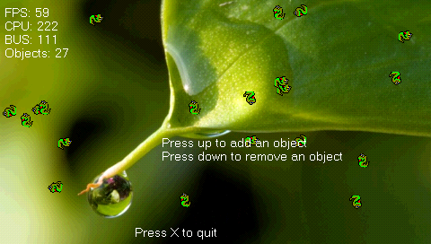
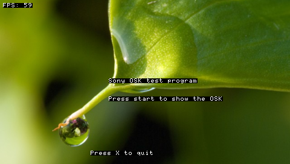
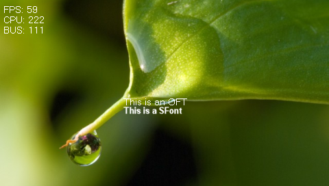

Sample scripts for Python on the Sony PSP, using the Python 2.5.2 (Stackless 3.1b3) port. Save the samples as `script.py` in the same folder as the Python interpreter (i.e. `EBOOT.PBP`) to run them.

## Sample scripts created by Sakya (2009)

The assets required to test these demos are available on the [release page of the repo](https://github.com/pierrelouys/PSP-StacklessPythonOSLibMOD/releases/) (`StacklessOSLibMOD-samples.zip`). 

### objects




```
# -*- coding: ISO-8859-1 -*-
import osl, pspos, drawable, random

osl.initGfx(osl.PF_5551, True)
osl.setDithering(True)
osl.setQuitOnLoadFailure(True)
osl.setFrameskip(1)
osl.setKeyAnalogToDPad(80)

bkg = osl.Image('bkg.png', osl.IN_RAM | osl.SWIZZLED, osl.PF_5551)
sprite = osl.Image('sprite.png', osl.IN_RAM | osl.SWIZZLED, osl.PF_5551)

ofont = osl.Font("font.oft")
osl.setTextColor(osl.RGBA(255,255,255,255))
osl.setBkColor(osl.RGBA(255,255,255,0))
ofont.set()

#Sprite animations (move and rotate)
def spriteAnim(obj):
    obj.image.rotate(obj.data["rotate"])
    newX = obj.x + obj.data["moveX"]
    newY = obj.y + obj.data["moveY"]
    sizeX = obj.image.centerX
    sizeY = obj.image.centerY
    if newX + sizeX > 480 or newX - sizeX < 0:
        obj.data["moveX"] = -obj.data["moveX"]
    elif newY + sizeY > 272 or newY - sizeY < 0:
        obj.data["moveY"] = -obj.data["moveY"]
    obj.x += obj.data["moveX"]
    obj.y += obj.data["moveY"]

def addSprite(layer, objName=None):
    if not objName:
        objName = "obj_%2.2i" % len(layer.objects)
    obj = drawable.imageObj(objName)
    obj.image = osl.Image((sprite.sizeX, sprite.sizeY), osl.IN_RAM, osl.PF_5551)
    sprite.copy(obj.image)
    obj.image.swizzle()
    obj.image.setRotationCenter()
    obj.x = random.randint(obj.image.centerX, 480 - obj.image.centerX)
    obj.y = random.randint(obj.image.centerY, 272 - obj.image.centerY)
    obj.data["rotate"] = random.randint(1, 5)
    obj.data["moveX"] = random.randint(1, 5)
    obj.data["moveY"] = random.randint(1, 5)
    obj.animations.append(spriteAnim)
    layer.addObject(obj)


def removeSprite(layer):
    names = layer.objects.keys()
    names.sort()
    if len(names):
        nameObj = names.pop()
        layer.removeObjectByName(nameObj)

layers = []
#Initial sprite objects
sprites = drawable.layer()
for i in xrange(0, 20, 1):
    addSprite(sprites)

layers.append(sprites)

#Initial generic objects
objects = drawable.layer()

#FPS
FPSobj = drawable.stringObj("FPS")
FPSobj.font = ofont
FPSobj.x = 5
FPSobj.y = 5
def FPSAnim(obj):
    obj.string = "FPS: %i" % osl.getFPS()
FPSobj.animations.append(FPSAnim)
objects.addObject(FPSobj)

#CPU freq
CPUobj = drawable.stringObj("CPU")
CPUobj.font = ofont
CPUobj.x = 5
CPUobj.y = 20
def CPUAnim(obj):
    obj.string = "CPU: %i" % pspos.getclock()
CPUobj.animations.append(CPUAnim)
objects.addObject(CPUobj)

#BUS freq
BUSobj = drawable.stringObj("BUS")
BUSobj.font = ofont
BUSobj.x = 5
BUSobj.y = 35
def BUSAnim(obj):
    obj.string = "BUS: %i" % pspos.getbus()
BUSobj.animations.append(BUSAnim)
objects.addObject(BUSobj)

#Objects count
objCount = drawable.stringObj("OBJ")
objCount.font = ofont
objCount.x = 5
objCount.y = 50
objCount.data["layer"] = sprites
objCount.data["objects"] = objects
def objCountAnim(obj):
    obj.string = "Objects: %i" % (len(obj.data["layer"].objects) + len(obj.data["objects"].objects), )
objCount.animations.append(objCountAnim)
objects.addObject(objCount)

#Messages
MSG1obj = drawable.stringObj("MSG1obj")
MSG1obj.font = ofont
MSG1obj.x = 180
MSG1obj.y = 150
MSG1obj.string = "Press up to add an object"
objects.addObject(MSG1obj)

MSG2obj = drawable.stringObj("MSG2obj")
MSG2obj.font = ofont
MSG2obj.x = 180
MSG2obj.y = 165
MSG2obj.string = "Press down to remove an object"
objects.addObject(MSG2obj)

MSG3obj = drawable.stringObj("MSG3obj")
MSG3obj.font = ofont
MSG3obj.x = 150
MSG3obj.y = 250
MSG3obj.string = "Press X to quit"
objects.addObject(MSG3obj)

layers.append(objects)

################################################################################
# Main program
################################################################################
skip = False
while not osl.mustQuit():
    if not skip:
        osl.startDrawing()

        bkg.draw()

        for layer in layers:
            layer.draw()

        osl.endDrawing()
    osl.endFrame()
    skip = osl.syncFrame()

    ctrl = osl.Controller()
    if ctrl.pressed_up:
        addSprite(sprites)
    elif ctrl.pressed_down:
        removeSprite(sprites)
    elif ctrl.pressed_cross:
        osl.safeQuit()

osl.endGfx()
```

`drawable.py`:

```
import osl

################################################################################
# Drawable
################################################################################
class drawable(object):
    """Class Drawable"""
    #Constructor
    def __init__(self, name=None):
        self.name = name
        self.visible = True
        self.x = 0
        self.y = 0
        self.animations = []
        self.data = {}


    #Methods:
    def draw(self):
        for animation in self.animations:
            animation(self)


################################################################################
# Image Object
################################################################################
class imageObj(drawable):
    """Class imageObj"""
    #Constructor
    def __init__(self, name=None):
        self.image = None
        drawable.__init__(self, name)

    #Methods:
    def draw(self):
        drawable.draw(self)
        if self.visible and self.image:
            self.image.draw(self.x, self.y)


################################################################################
# String Object
################################################################################
class stringObj(drawable):
    """Class stringObj"""
    #Constructor
    def __init__(self, name=None):
        self.font = None
        self.string = None
        self.textColor = osl.RGBA(255,255,255,255)
        self.backColor = osl.RGBA(255,255,255,0)
        drawable.__init__(self, name)

    #Methods:
    def draw(self):
        drawable.draw(self)
        if self.visible and self.font:
            self.font.set()
            osl.setTextColor(self.textColor)
            osl.setBkColor(self.backColor)
            osl.drawString(self.x, self.y,  self.string)


################################################################################
# Layer
################################################################################
class layer(object):
    """Class Layer"""
    #Constructor
    def __init__(self):
        self.objects = {}

    #Methods:
    def addObject(self, obj):
        if obj.name == None:
            raise ValueError, 'name'
        self.objects[obj.name] = obj
        return True

    def removeObject(self, obj):
        if obj.name == None:
            raise ValueError, 'name'
        if obj.name in self.objects:
            del self.objects[obj.name]
            return True
        return False

    def removeObjectByName(self, objName):
        obj = drawable(objName)
        return self.removeObject(obj)

    def draw(self):
        for key, obj in self.objects.iteritems():
            obj.draw()
```

### OSK



This sample will not run on PPSSPP unless the original system fonts are installed. 

```
# -*- coding: ISO-8859-1 -*-

import osl

osl.initGfx(osl.PF_8888, True)
osl.intraFontInit(osl.INTRAFONT_CACHE_MED)
osl.setQuitOnLoadFailure(True)

bkg = osl.Image('bkg.png', osl.IN_RAM | osl.SWIZZLED, osl.PF_8888)

ifont = osl.Font("flash0:/font/ltn0.pgf")
osl.intraFontSetStyle(ifont, 1.0, osl.RGBA(255,255,255,255), osl.RGBA(0,0,0,0), osl.INTRAFONT_ALIGN_LEFT)
ifont.set()

skip = False
message = ""

while not osl.mustQuit():
    if not skip:
        osl.startDrawing()

        bkg.draw()

        osl.drawString(5, 5, "FPS: %i" % osl.getFPS())

        osl.drawString(180, 130, "Sony OSK test program")
        osl.drawString(180, 160, "Press start to show the OSK")
        osl.drawString(180, 190, message)

        osl.drawString(150, 250, "Press X to quit")

        if osl.oskIsActive():
            osl.drawOsk()
            if osl.getOskStatus() == osl.DIALOG_NONE:
                if osl.oskGetResult() == osl.OSK_CANCEL:
                    message = "Cancel"
                else:
                    userText = osl.oskGetText()
                    message = "You entered: %s" % userText
                osl.endOsk()

        osl.endDrawing()
    osl.endFrame()
    skip = osl.syncFrame()

    if not osl.oskIsActive():
        ctrl = osl.Controller()
        if ctrl.held_cross:
            osl.safeQuit()
        elif ctrl.pressed_start:
            osl.initOsk("Please insert some text", "Initial text", 128, 1, osl.OSK_ENGLISH)

osl.endGfx()
```

### fonts

This sample will not run on PPSSPP unless the original system fonts are installed.

The OSLibMOD version of PSP-StacklessPython supports the OSLib font format (.oft). These font files can be created with the conversion utility found here: [OSLFonts](https://github.com/pierrelouys/OSLFonts/tree/main).



```
# -*- coding: ISO-8859-1 -*-

import osl, pspos

osl.initGfx(osl.PF_8888, True)
osl.intraFontInit(osl.INTRAFONT_CACHE_ALL | osl.INTRAFONT_STRING_UTF8)
osl.setQuitOnLoadFailure(True)

bkg = osl.Image('bkg.png', osl.IN_RAM | osl.SWIZZLED, osl.PF_8888)

ofont = osl.Font("font.oft")
ifont = osl.Font("flash0:/font/ltn0.pgf")
osl.setTextColor(osl.RGBA(255,255,255,255))
osl.setBkColor(osl.RGBA(255,255,255,0))

sfont = osl.SFont("sfont.png")

osl.intraFontSetStyle(ifont, 1.0, osl.RGBA(255,255,255,255), osl.RGBA(0,0,0,0), osl.INTRAFONT_ALIGN_LEFT)

skip = False

while not osl.mustQuit():
    if not skip:
        osl.startDrawing()

        bkg.draw()

        FPS = osl.getFPS()
        ofont.set()
        osl.drawString(5, 5,  "FPS: %i" % FPS)
        osl.drawString(5, 20, "CPU: %i" % pspos.getclock())
        osl.drawString(5, 35, "BUS: %i" % pspos.getbus())

        ifont.set()
        osl.drawString(180, 120, "This is IntraFont")
        ofont.set()
        osl.drawString(180, 140, "This is an OFT")

        sfont.drawString(180, 155, "This is a SFont");

        ifont.set()
        osl.drawString(150, 250, "Press X to quit")

        osl.endDrawing()
    osl.endFrame()
    skip = osl.syncFrame()

    ctrl = osl.Controller()
    if ctrl.held_cross:
        osl.safeQuit()

osl.endGfx()
```

### netDialog

This sample will not run on PPSSPP unless the original system fonts are installed. 


```
# -*- coding: ISO-8859-1 -*-

import osl

osl.initGfx(osl.PF_8888, True)
osl.intraFontInit(osl.INTRAFONT_CACHE_MED)
osl.setQuitOnLoadFailure(True)
#osl.netInit()

bkg = osl.Image('bkg.png', osl.IN_RAM | osl.SWIZZLED, osl.PF_8888)

ifont = osl.Font("flash0:/font/ltn0.pgf")
osl.intraFontSetStyle(ifont, 1.0, osl.RGBA(255,255,255,255), osl.RGBA(0,0,0,0), osl.INTRAFONT_ALIGN_LEFT)
ifont.set()

skip = False
dialog = osl.DIALOG_NONE

while not osl.mustQuit():
    if not skip:
        osl.startDrawing()

        bkg.draw()

        osl.drawString(5, 5, "FPS: %i" % osl.getFPS())

        osl.drawString(180, 130, "Network dialog test program")
        osl.drawString(180, 160, "Press start to show the network dialog")

        osl.drawString(150, 250, "Press X to quit")

        dialog = osl.getDialogType()
        if dialog != osl.DIALOG_NONE:
            osl.drawDialog()
            if osl.getDialogStatus() == osl.DIALOG_NONE:
                osl.endDialog()

        osl.endDrawing()
    osl.endFrame()
    skip = osl.syncFrame()

    if dialog == osl.DIALOG_NONE:
        ctrl = osl.Controller()
        if ctrl.pressed_cross:
            osl.safeQuit()
        elif ctrl.pressed_start:
            osl.initNetDialog()

#osl.netTerm()
osl.endGfx()
```

## Other sample scripts

These samples have only been tested on PPSSPP so far. 

### OSK

```
import osl

osl.initGfx(osl.PF_8888, True)
osl.setQuitOnLoadFailure(True)

text = ""
while not osl.mustQuit():
    osl.startDrawing()
    osl.clearScreen(osl.RGBA(0, 0, 0, 255))
    osl.drawString(10, 10, "Text: " + text)
    osl.drawString(10, 30, "Press X to open keyboard")
    
    pad = osl.Controller()
    if pad.released_cross and not osl.oskIsActive():
        osl.initOsk("Enter text", text, 128, 1)
    
    if osl.oskIsActive():
        osl.drawOsk()
        if osl.getOskStatus() == 0:
            if osl.oskGetResult() != osl.OSK_CANCEL:
                text = osl.oskGetText()
            osl.endOsk()
    
    osl.endDrawing()
    osl.endFrame()
    osl.syncFrame()

osl.endGfx()
```

### Dialogs

```
import osl

osl.initGfx(osl.PF_8888, True)
osl.setQuitOnLoadFailure(True)

while not osl.mustQuit():
    osl.startDrawing()
    osl.clearScreen(osl.RGBA(0, 0, 0, 255))
    osl.drawString(10, 10, "Press X to show message dialog")
    
    pad = osl.Controller()
    if pad.released_cross and not osl.getDialogType():
        osl.initMessageDialog("Hello, this is a message!", 0)
    
    if osl.getDialogType():
        osl.drawDialog()
        if osl.getDialogStatus() == 0:
            osl.endDialog()
    
    osl.endDrawing()
    osl.endFrame()
    osl.syncFrame()

osl.endGfx()
```

### Image

```
import osl

osl.initGfx(osl.PF_8888, True)
osl.setQuitOnLoadFailure(True)

# Replace with a valid image path
image = osl.Image("test.png", osl.IN_RAM, osl.PF_8888)
image.x = 100
image.y = 100

while not osl.mustQuit():
    osl.startDrawing()
    osl.clearScreen(osl.RGBA(0, 0, 0, 255))
    image.draw()
    osl.drawString(10, 10, "Image displayed at (100, 100)")
    
    osl.endDrawing()
    osl.endFrame()
    osl.syncFrame()

osl.endGfx()
```

### OFT Font

```
import osl

osl.initGfx(osl.PF_8888, True)
osl.setQuitOnLoadFailure(True)

# Replace with a valid font path
font = osl.Font("font.oft")
osl.setTextColor(osl.RGBA(255, 255, 255, 255))
osl.setBkColor(osl.RGBA(0, 0, 0, 0))

while not osl.mustQuit():
    osl.startDrawing()
    osl.clearScreen(osl.RGBA(0, 0, 0, 255))
    font.set()
    osl.drawString(10, 10, "Hello, this is a custom font!")
    
    osl.endDrawing()
    osl.endFrame()
    osl.syncFrame()

osl.endGfx()
```

### SFont

```
import osl

osl.initGfx(osl.PF_8888, True)
osl.setQuitOnLoadFailure(True)

# Replace with a valid SFont image path
sfont = osl.SFont("sfont.png")

while not osl.mustQuit():
    osl.startDrawing()
    osl.clearScreen(osl.RGBA(0, 0, 0, 255))
    sfont.drawString(10, 10, "SFont Text")
    osl.drawString(10, 30, "Press X to quit")
    
    pad = osl.Controller()
    if pad.pressed_cross:
        osl.safeQuit()
    
    osl.endDrawing()
    osl.endFrame()
    osl.syncFrame()

osl.endGfx()
```

### Sound

```
import osl

osl.initGfx(osl.PF_8888, True)
osl.setQuitOnLoadFailure(True)
osl.initAudio()

# Replace with a valid sound path
sound = osl.Sound("sound.wav")

while not osl.mustQuit():
    osl.startDrawing()
    osl.clearScreen(osl.RGBA(0, 0, 0, 255))
    osl.drawString(10, 10, "Press X to play sound")
    
    pad = osl.Controller()
    if pad.released_cross:
        sound.play(1)
    
    osl.endDrawing()
    osl.endFrame()
    osl.syncFrame()
    osl.audioVSync()

osl.endGfx()
```

### MP3 files

```
import osl
import pspmp3

osl.initGfx(osl.PF_8888, True)
osl.setQuitOnLoadFailure(True)
pspmp3.init(1)

# Replace with a valid MP3 path
pspmp3.load("song.mp3")

while not osl.mustQuit():
    osl.startDrawing()
    osl.clearScreen(osl.RGBA(0, 0, 0, 255))
    osl.drawString(10, 10, "Press X to play, Triangle to stop")
    
    pad = osl.Controller()
    if pad.released_cross:
        pspmp3.play(True)
    if pad.released_triangle:
        pspmp3.stop()
    
    osl.endDrawing()
    osl.endFrame()
    osl.syncFrame()

pspmp3.stop()
osl.endGfx()
```

### Net Dialog

```
import osl

osl.initGfx(osl.PF_8888, True)
osl.setQuitOnLoadFailure(True)

connected = False
while not osl.mustQuit():
    osl.startDrawing()
    osl.clearScreen(osl.RGBA(0, 0, 0, 255))
    osl.drawString(10, 10, "Press X to open network dialog")
    osl.drawString(10, 30, "Connected: %s" % connected)
    
    pad = osl.Controller()
    if pad.released_cross and not osl.getDialogType():
        osl.initNetDialog()
    
    if osl.getDialogType():
        osl.drawDialog()
        if osl.getDialogStatus() == 0:
            if osl.dialogGetResult() != osl.DIALOG_CANCEL:
                connected = True
            osl.endDialog()
    
    osl.endDrawing()
    osl.endFrame()
    osl.syncFrame()

if connected:
    osl.netTerm()
osl.endGfx()
```

## Key differences from modern Python (3.x):

The current build of PSP Python is version 2.5.2 from August 2009, and is based on Stackless 3.1b3 060516 (python-2.51:55047).

Some peculiarities of Python 2.51:

- No `with` statement: manually handle opening and closing the file with `(f = open(...)` and `f.close()`.
- No f-string syntax and no .format() method: use `%s` for string formatting.
- No `except Exception as e` syntax: use `except Exception, e`.
